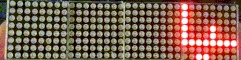

# PersianFontDotMatris
<b>فونت فارسی برای دات ماتریس های هشت در هشت</b>
 
این پروژه با اردوینو و ماژول های ۷۲۱۹ انجام شده ولی فونت در پروژه های دیگر نیز قابل استفاده .میباشد
 

# Output

# How to use
You can find alphabet <a href="./alphabet.txt">here</a>
 

And for parser see <a href="./psychoLED.ino">here</a>
inside of "printStringWithShift()" and "printPersianCharWithShift()" functions
 

# Who is behind this
<a href="https://github.com/bgl-mmd">Mohammad</a> 
 
<a href="https://github.com/ali77gh">Ali</a>
 

# License
MIT
